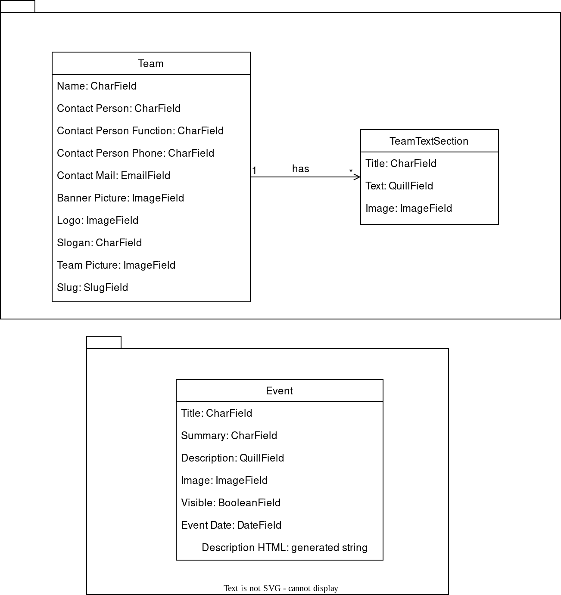

# Future Factory Website Documentation
Over here you can find the documentation for the Future Factory website.

The website is written in Python using the [Django](https://www.djangoproject.com/) framework. At the moment 
[Tom Meulenkamp](https://github.com/supertom01/) from RoboTeam Twente is the lead maintainer on this website and is also 
responsible for hosting it. However, this should not discourage other people from wanting to help and work on this site. 

The code structure attempts to make it easy to search through and is written in a way that should not be too complex for
someone with some experience with the Django framework. 

Although the code has some documentation incorporated into it, this documentation will focus more on the general picture
allowing one to understand on how all of these components work together.

## Table of Contents
For each Django [app](https://docs.djangoproject.com/en/4.1/ref/applications/) a page is available, additionally on this
page you will be able to find more general information

* [Events](events.md)
* [Teams](teams.md)
* [Facts](facts.md)
* [News Articles](news_articles.md)
* [Contact](contact.md)
* [Settings](settings.md)

## General Information
Most entities have their own module (also known as app) within this project. This allows for a clear distribution 
between models, views and other stuff. 

### Class Diagram


### Navigation bar highlighting
When you're somewhere on the website, your current location is highlighted in the navigation bar. This is done with the 
help of the context variable, `current`, that is passed on by each view. The constant strings that are assigned to it 
are hardcoded. An example from the TeamView looks like this:

```python
    def get_context_data(self, **kwargs):
        context = super(self).get_context_data(**kwargs)
        context['current'] = "teams"
        return context
```

At this moment one can choose between the following constants: `home`, `teams`, `events`, `partners` & `contact`

### Automated image compression
Images are automatically compressed, allowing for quick load times and an overall responsive website. This compression 
happens on each image field that is defined somewhere in model. This compressing happens on the fly when a model is 
being created or updated. The compress function can be found in `future_factory_website/utils.py`.  

**Note**: When using the `compress` function on an optional `ImageField` make sure to check if an image is actually 
selected. The `compress` cannot handle empty fields. Checking this is done as follows:

```python
class ExampleModel(models.Model):
    image = models.ImageField(null=True, blank=True)

    def save(self, *args, **kwargs):
        # Check if we actually have selected an image.
        if self.image:
            self.image = compress(self.image)
        super(self).save(*args, **kwargs)
```
