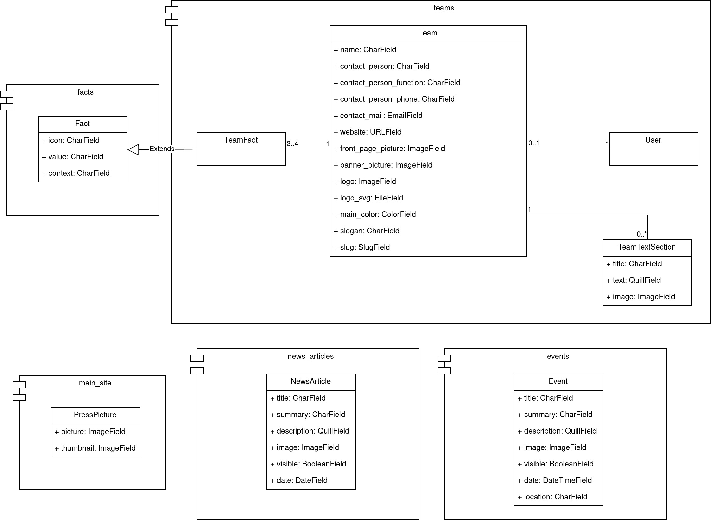

# Future Factory Website Documentation
Over here you can find the documentation for the Future Factory website.

The website is written in Python using the [Django](https://www.djangoproject.com/) framework. At the moment 
[Tom Meulenkamp](https://github.com/supertom01/) from RoboTeam Twente is the lead maintainer on this website and is also 
responsible for hosting it. However, this should not discourage other people from wanting to help and work on this site. 

The code structure attempts to make it easy to search through and is written in a way that should not be too complex for
someone with some experience with the Django framework. 

Although the code has some documentation incorporated into it, this documentation will focus more on the general picture
allowing one to understand on how all of these components work together.

## Table of Contents
* [Events](events.md)
* [Facts](facts.md)
* [News Articles](news_articles.md)
* [Partners](partners.md)
* [Teams](teams.md)
* [Contact](contact.md)
* [Settings](settings.md)
* [Styling](styling.md)

## General Information
Most entities have their own module (also known as [app](https://docs.djangoproject.com/en/4.1/ref/applications/)) 
within this project. This allows for a clear distribution between models, views and other stuff. 

### Class Diagram


### Templates
Each page that one sees is built with the Django [template](https://docs.djangoproject.com/en/4.1/ref/templates/) system.
Every page extends the `basis.html` template that can be found in `/templates`. This template handles the basis HTML 
structure such as meta tags, favicons, the navigation bar and the footer. Each template then 
[inherits](https://docs.djangoproject.com/en/4.1/ref/templates/language/#template-inheritance) this basic template and
is able to fill out the following blocks:

* description
  * Contains a short description about this specific page. This will be shown in the Google search results.
* title
  * The title of the current page.
* head
  * Additional HTML that should go into the head, for example additional stylesheets.
  * Also, these blocks usually contain additional CSS, for example to override the default background picture in the 
    header.
* nav_bar
  * By default the navigation bar only contains the logo and home button. Any additional buttons should be added with
    the following HTML:
    ```html
    <li class="nav-item">
        <a class="nav-link" href="_link_location_">Nav item</a>
    </li>
    ```
* content
  * The actual contents of this page. This will mainly contain `<section>` elements.
* scripts
  * Any JavaScript that should be loaded into the page, this will be placed after the `</body>` tag.

#### Error pages
If a page cannot be found or the server raises an uncaught exception, the user will see an error message. The templates
for these pages can be found in `/templates` and are named according to their HTTP error codes.

### Automated image compression
Images are automatically compressed, allowing for quick load times and an overall responsive website. This compression 
happens on each image field that is defined somewhere in model. This compressing happens on the fly when a model is 
being created or updated. The compress function can be found in `future_factory_website/utils.py`.  

**Note**: When using the `compress` function on an optional `ImageField` make sure to check if an image is actually 
selected. The `compress` cannot handle empty fields. Checking this is done as follows:

```python
class ExampleModel(models.Model):
    image = models.ImageField(null=True, blank=True)

    def save(self, *args, **kwargs):
        # Check if we actually have selected an image.
        if self.image:
            self.image = compress(self.image)
        super(self).save(*args, **kwargs)
```
