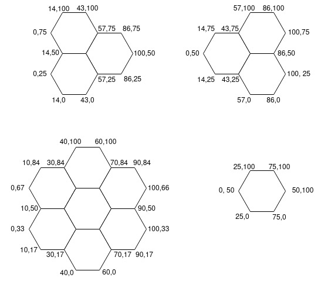

# Partners
Partners are not actively being stored in the database. New partners can be added by modifying the `main.html` and 
`partners.scss` files. Let's start out with the structure of the HTML.

## HTML Structure
All the partners are located within the following `div` located in `/main_site/templates/main.html`:
```html
<div id="partner-hexagons"></div>
```

Each partner has their own hexagon, possibly varying in size. However, each hexagon element has the following structure:
```html
<a id="_partner_" class="hexagon _size_ _args_" href="_partner_website_" style="background-color: _hexagon_color_" title="_partner_">
    
</a>
```
The hexagons are available in three sizes: `small`, `medium`, `large`. The size is added as a class, in the example 
above, it is called \_size\_. The medium size has an additional option, the values for this option are either `left` or 
`right`. These values indicate whether the third hexagon sticks out either left or right.

Ones filled out, the hexagon should still be positioned correctly within the div, this is done with (S)CSS.

## SCSS Structure
The correct SCSS file can be found at `/static/public_html/assets/scss/partners.scss`. The positioning of the individual
hexagons are located at the bottom of the file. Since they are each positioned relative in the container we have to 
define the `top` and `left` coordinates of our div, resulting in a rule looking like:
```scss
&#_partner_ {
  top: ;
  left: ;
}
```

The offsets have to be calculated by hand. In order to achieve this we can use the known width and height of all the 
sizes of hexagons. These can all the accessed as css variables like: 
```css
var(--hexagon_size_dimension)
```
where size should be `small`, `medium`, or `big` and dimension should be `height` or `width`. 

To help with the positioning the relative dimensions of each hexagon type are shown in the picture below



When adding hexagons at the outer edges, be aware of the fact that the width and/or height of the total container will
change. You have to compensate for this by updating the `--hexagon_small_width` and `--hexagon_margin` variables on the
top of the .scss file. Additionally, you will have to update the width and height of the `partner-hexagons` container.